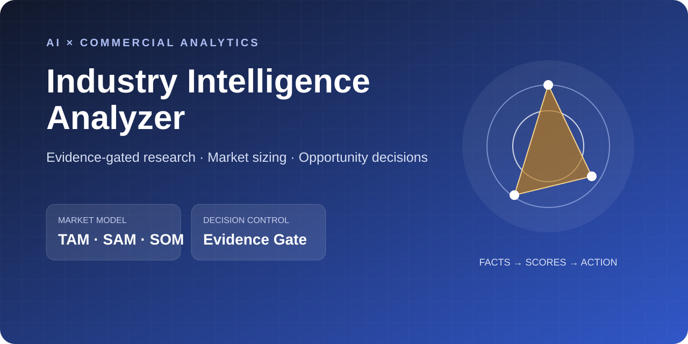
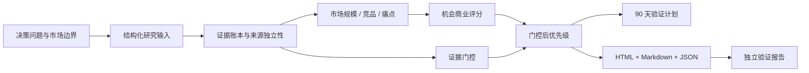

# Industry Intelligence Analyzer

> 把 AI 行业研究从“信息堆砌”变成可复算、可追溯、可行动的商业决策系统。



[](https://github.com/muse05112003-cmyk/industry-intelligence-analyzer/actions/workflows/ci.yml)
[](https://nodejs.org/)
[](LICENSE)
[](examples/synthetic-demo/README.md)

## 一句话看懂

输入一份结构化行业研究数据，项目会自动完成：

- Bottom-up TAM / SAM / SOM 三情景测算；
- 竞品五维横评与用户痛点排序；
- 带“证据门控”的机会优先级评分；
- 90 天验证计划、证据账本和独立质量报告；
- 可直接分享和打印的单文件 HTML 决策报告。

本仓库的重点不是“让 AI 写一篇很长的报告”，而是约束 AI：**来源不足时，不能把高吸引力假设包装成高优先级结论。**

## 核心能力

这是一个完整的数据产品，而不是 Prompt 或静态文档：

| 能力 | 在项目中的体现 |
|---|---|
| AI 产品设计 | 将行业研究拆成输入契约、分析引擎、证据门控、报告和验证五层 |
| 商业分析 | 市场边界、TAM/SAM/SOM、竞品定位、用户痛点、机会排序、90 天 MVP |
| 数据治理 | 来源分级、独立性判断、断链检测、数据截至日期、合成数据标识 |
| 软件工程 | 零运行时依赖、CLI、单元测试、端到端测试、CI、安全审计 |
| 报告交付 | 结论先行 HTML 报告、方法文档、证据账本和机器可读 JSON |

## 30 秒演示

```bash
git clone https://github.com/muse05112003-cmyk/industry-intelligence-analyzer.git
cd industry-intelligence-analyzer
npm install
npm run demo
```

然后打开：

```text
examples/synthetic-demo/output/report.html
```

完整检查：

```bash
npm run check
```

## 示例结论

仓库自带“城市通勤骑行安全配件”合成案例。所有品牌、数字、用户和来源均为虚构，只用于证明方法与代码。

案例会刻意放入一个商业评分很高、但只有一条待复核社媒来源的机会。分析引擎会把它封顶在假设级，不允许进入高优先级；这证明项目真正执行了证据治理，而不只是报告里写着“请谨慎”。

[查看案例说明](examples/synthetic-demo/README.md) · [查看生成报告](examples/synthetic-demo/output/report.html) · [查看验证结果](examples/synthetic-demo/output/98_VALIDATION_REPORT.md)

## 工作流



## 核心方法

### 1. 市场规模

```text
TAM = 可服务客户数 × 年均支出
SAM = TAM × 可服务比例
SOM = SAM × 可获取比例
```

系统同时计算保守、基准和积极情景，并保留每个输入假设，避免只给一个不可解释的大数字。

### 2. 机会评分

```text
机会原始分 = 需求强度 30% + 竞争缺口 25% + 证据强度 20%
           + 可执行性 15% + 时间紧迫性 10%
```

### 3. 证据门控

| 证据状态 | 判定 | 最终分上限 | 可以做什么 |
|---|---|---:|---|
| `decision_ready` | 至少两个独立、质量达标的来源 | 10.0 | 进入行动设计 |
| `directional` | 至少一个已验证或经复核来源 | 6.9 | 先做定向验证 |
| `hypothesis` | 无可靠来源或仅待复核信号 | 4.9 | 只能保留为假设 |

更多细节见 [方法论](docs/methodology.md) 与 [数据契约](docs/data-contract.md)。

## 输出结构

```text
output/
├── 00_EXECUTIVE_SUMMARY.md
├── 01_MARKET_SIZING.md
├── 02_COMPETITIVE_LANDSCAPE.md
├── 03_CUSTOMER_PAIN_POINTS.md
├── 04_OPPORTUNITY_PRIORITIZATION.md
├── 05_90_DAY_PLAN.md
├── 98_VALIDATION_REPORT.md
├── 99_EVIDENCE_LEDGER.md
├── analysis.json
└── report.html
```

## 自定义输入

复制案例输入并替换为自己的研究数据：

```bash
node src/process_industry.js path/to/input.json --out path/to/output
```

输入必须包含：

- `meta`：研究标题、边界、截至日期、币种、是否合成；
- `decision`：要支持的业务决策、受众和期限；
- `marketSizing`：三情景测算参数；
- `sources`：可追溯的证据账本；
- `competitors`、`painPoints`、`opportunities`：分析对象及其来源 ID。

## AI Skill

根目录 [SKILL.md](SKILL.md) 是可安装的 Agent Skill。它融合了新增“全域蒸馏器”的四模式、三深度档位、行业骨架和研究模板，并加入本项目的决策问题、市场测算、证据门控和验证要求。

可复用资产：

- `assets/skeletons/`：通用、消费品、SaaS、AI 工具行业骨架；
- `assets/templates/`：品牌、竞品、知识卡与机会卡模板；
- `references/research-playbook/`：模式选择、搜索策略和复盘问题。

## 项目结构

```text
.
├── SKILL.md
├── agents/openai.yaml
├── assets/
├── docs/
├── examples/synthetic-demo/
├── references/research-playbook/
├── scripts/
├── src/
└── tests/
```

## 设计取舍

- **零运行时依赖**：只用 Node.js 标准库，降低供应链风险和复现成本。
- **结构化输入而非自动编造研究**：数据采集可由 AI、人或其他工具完成；本项目专注可审计的计算与交付。
- **合成案例而非伪装的真实案例**：公开仓库不把无法验证的数字包装成行业事实。
- **建议与证据分开**：原始商业吸引力保留，但最终优先级由证据门控约束。

## 延伸文档

- [发布检查清单](docs/release-checklist.md)：公开前的代码、数据、文档与视觉检查。

## 边界

本项目输出是决策支持，不是事实数据库，也不替代财务、法律、监管或专业市场研究。真实数据对外发布前，应确认数据授权、来源许可、个人信息和商业秘密处理要求。

## License

[MIT](LICENSE)
